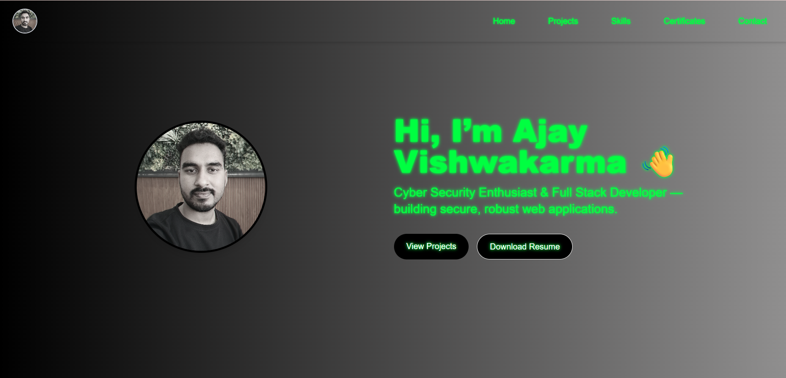
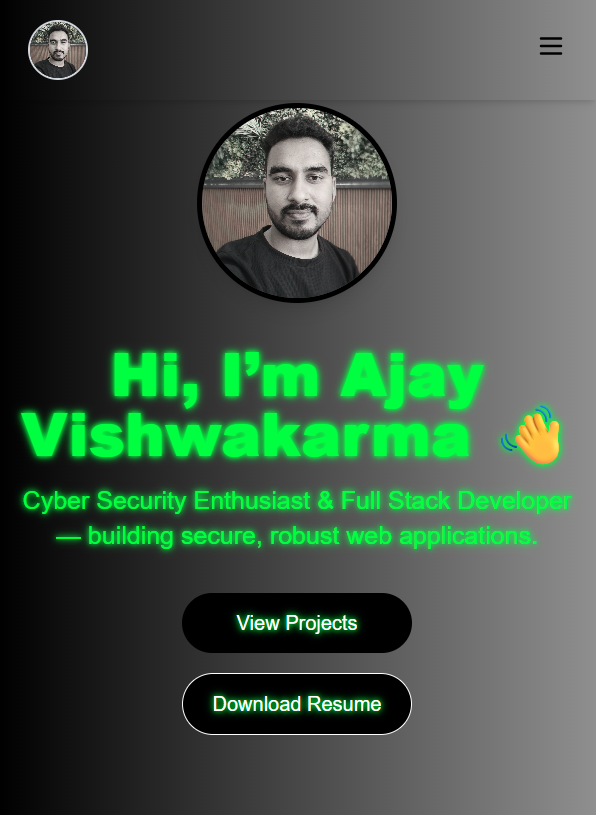

# 🌟 PortFolio

<p align="center">
  
  
</p>

Welcome to **PortFolio** – a sleek, customizable personal portfolio site built to showcase your work, skills, and online presence.

---

## 🚀 Features

- **Responsive Design:** Looks great on any device
- **Easy Customization:** Swap images, update content, and add your projects
- **Modern Tech Stack:** Built with TypeScript, JavaScript, and CSS
- **Fast & SEO Friendly:** Optimized for performance and discoverability


## 📝 How to Use

Follow these steps to set up and personalize your portfolio:

1. **Clone this repository**
    ```bash
    git clone https://github.com/ajayvishwakarma2k21/PortFolio.git
    cd PortFolio
    ```

2. **Install dependencies**
    ```bash
    npm install
    ```

3. **Run the development server**
    ```bash
    npm start
    ```
    Visit `http://localhost:3000` in your browser.

4. **Customize Your Portfolio**
    - Replace `public/pp/1.png` and `public/pp/2.png` with your own images.
    - Edit your profile, skills, projects, and social links in the relevant files inside `src/pages` or `src/components`.
    - Update colors, fonts, and layouts as desired.

5. **Build for Production**
    ```bash
    npm run build
    ```
    Deploy the content from the `build` folder to your chosen hosting provider (Vercel, Netlify, GitHub Pages, etc.).

---

## 💡 Customization Tips

- **Images:** Place your images in `public/pp/` and update their references if needed.
- **Content:** Change profile details, project descriptions, and contact info in the source code.
- **Styling:** Modify CSS files to personalize colors and layouts.

---

## 🤝 Contributing

Have ideas or improvements?  
Feel free to fork, submit pull requests, or open issues!

---


> Made with ❤️ by [ajayvishwakarma2k21](https://github.com/ajayvishwakarma2k21)
